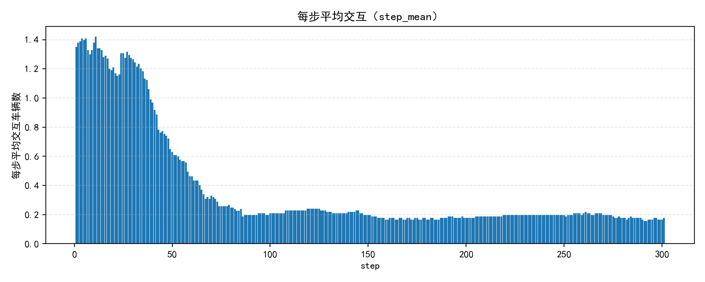
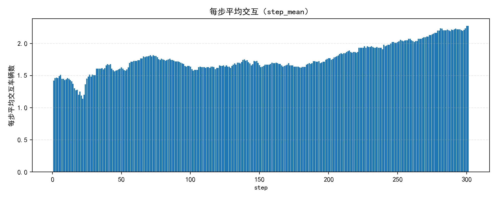
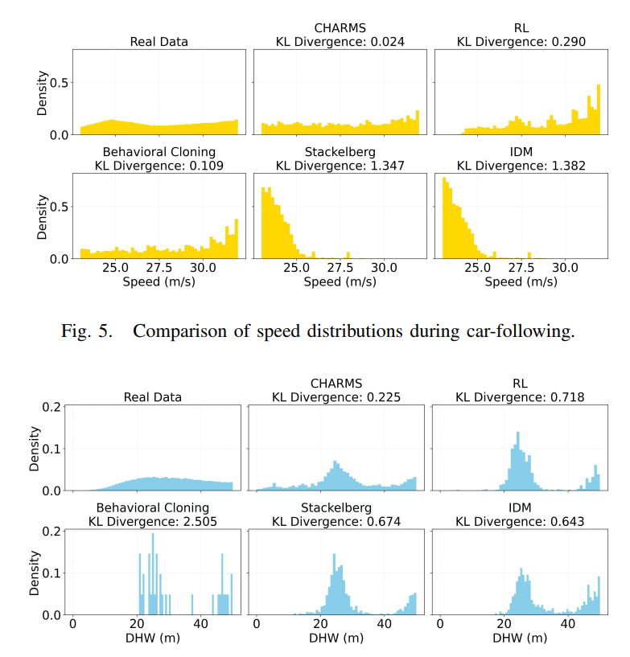

## 问题描述
L2在L1环境中训练过程中，由于道路限速影响，大部分时间都是处于定速巡航状态，未发生交互。
这种情况下按照论文判断30m内的同车道或相邻车道每一时间步的车辆数量（Interaction Density）是没有意义的，并不能在训练过程中尽可能遍历状态空间所有状态，导致最终得到的交互行为是不合理准确的。

### L2与L1不同
L1在L0(IDM)环境中训练，相对简单，所以直接训练L1就可以得到较好效果

L2在L1环境中训练，训练环境更复杂，所以需要对L2策略进行一些专门调整

解决办法：
# Safety-PER：
#### ① 修改车辆的最大期望速度，随机化(扰动增强，速度扰动)

重新设计交互强度指标，证明交互性指标提高。

$$ 
   I_t \;=\; \sum_{j \in \mathcal{N}(t)}
\mathbf{1}\!\left\{R_{ij} < R_{\max}\right\}
\, \mathbf{1}\!\left\{|\Delta v_{ij}| > \varepsilon_v\right\}
 
$$

保持相同限速：

交互指标$$ I_t = 0.38 $$ 

修改被训练车限速：

交互指标$$ I_t = 1.77 $$ 

随机化车辆的**期望速度上限（期望速度）** 显著提升异质性与训练过程中的交互密度，缓解策略对单一速度谱的过拟合

#### ② 有针对性设计交互场景，和随机场景比例（7：3）

场景设计(不专门设计纵向交互场景)

**横向场景**

#### 1.切出场景
#### 2.切出有前车场景
#### 3.切入场景
#### 4.切入有前车场景

#### ③ Safety-PER:
近碰撞、并线冲突、极端车流密度等“少见但关键”的片段——均匀重放很难覆盖，PER 能显著提高它们被采到的概率,减少无效梯度。标准 PER 只按 TD 误差大小抽样，容易忽视低 TD 但高风险的情形（如接近碰撞、TTC 极小但奖励还没反馈）。Safety-PER 在优先级中引入安全分（Safety Score, 𝑆，让“安全关键片段”更易被回放。

Double DQN 目标与 TD 误差:
$$
a'=\arg\max_{a}Q_{\theta}(s',a),\qquad
y=r+\gamma(1-d)\,Q_{\bar\theta}(s',a')
$$

$$
Q_{\theta}(s,a)=\big[Q_{\theta}(s,\cdot)\big]_a,\qquad
\delta=y-Q_{\theta}(s,a)
$$

Huber 损失（Smooth L1）:
$$
\mathcal{L}_{\text{Huber}}(\delta)=
\begin{cases}
\dfrac{1}{2}\delta^2,&|\delta|\le \kappa\\[6pt]
\kappa\left(|\delta|-\dfrac{1}{2}\kappa\right),&\text{otherwise}
\end{cases}
$$

PER：优先级、采样概率、IS 权重与加权损失:
$$
P_i=\big(|\delta_i|+\varepsilon\big)^{\alpha}
$$

$$
p_i=\frac{P_i}{\sum_j P_j}
$$

$$
w_i=\left(\frac{1}{N}\cdot\frac{1}{p_i}\right)^{\beta},\qquad
\tilde w_i=\frac{w_i}{\max_k w_k}
$$

$$
\mathcal{L}
=\frac{\sum_{i\in \mathcal{B}}\tilde w_i\,\mathcal{L}_{\text{Huber}}(\delta_i)}
{\sum_{i\in \mathcal{B}}\tilde w_i}
$$

Safety-PER（乘性放大）:
$$
P_i
=\big(|\delta_i|+\varepsilon\big)^{\alpha}\cdot\big(1+\lambda_s\,S_i\big)
$$

安全分 S 的定义（TTC/THW 例）
$$
S_{\text{TTC}}=\operatorname{clip}\!\left(1-\frac{\text{TTC}}{\tau_{\max}},\,0,\,1\right),\qquad
S_{\text{THW}}=\operatorname{clip}\!\left(1-\frac{\text{THW}}{\theta_{\max}},\,0,\,1\right)
$$

$$
S=\operatorname{clip}\!\big(\max\{\lambda_1 S_{\text{TTC}},\,\lambda_2 S_{\text{THW}},\,\lambda_3 \mathbf{1}[\text{crash}]\},\,0,\,1\big)
$$

## 验证行为真实性问题 HighD

**很好解决** 

基于HighD统计数据设置不同车辆的**最高限速**,让模型生成的行为尽可能接近该分布

EG:0.8:2.0:0.4; 0.8:1.6:0.4; 0.8:1.2:0.4
PR:0.8:2.0:0.2; 0.8:1.4:0.2; 0.8:0.8:0.2

# 针对egoistic风格

## TTC平均（L2在L1环境 1000episode）
**saeg**：27.91s
**efeg_0.6_normal**：22.41s
**efeg_0.8_radical**：20.77s

## 速度分布（L2在L1环境 1000episode）
**saeg**：TBD
**efeg**：TBD

## THW平均（L2在L1环境 1000episode）
**saeg**：1.25s
**efeg_0.6_normal**：1.22s
**efeg_0.8_radical**：1.19s

## 在L0(IDM)环境中碰撞率 1000episode
**saeg**:1.60%
**efeg_normal**:2.60%
**efeg_radical**:3.40%
**文献**：2.30%

## 在IDM+MOBIL环境中碰撞率 1000episode
**saeg**:2.60%
**efeg_normal**:4.80%
**efeg_radical**:7.60%

## 在L1环境中碰撞率 1000episode
**saeg**:4.20%
**efeg_normal**:5.10%
**efeg_radical**:7.20%

## SVO风格表现验证 ##
因为在我的设定下仅有L2体现SVO风格，而L2在L1环境中训练，所以以L1环境为base环境，通过时间损失去反映SVO风格奖励设置的有效性。

设置三种环境：
①L1环境和自利型SVO=0时L2 -> 环境车时间损失 & Ego时间损失  
②L1环境和合作型SVO=pi/4时L2 -> 环境车时间损失 & Ego时间损失  
③L1环境和将L2替换为L1对比baseline环境 -> 环境车时间损失  

定义时间损失指标（相对）:
每辆车会有期望最大速度，以这个自由流速度作为基准：
$$
\delta_i = \frac{T_i - T_i^{\text{free}}}{T_i^{\text{free}}}, \quad
T_i^{\text{free}} = \frac{L_i}{v_{\text{free}}}
$$

| 风格编号 | 风格类型       | SVO φ           | 驾驶倾向 | 自车时间损失 $$\bar{\delta}_{ego}$$ / %| 其他车时间损失 $$\bar{\delta}_{others}$$ / % | 公平性比值 $$R_{fair} = \bar{\delta}_{ego} / \bar{\delta}_{others} $$ |
|----------|----------------|-----------------|----------|----------------------------------------|--------------------------------------------|---------------------------------------------------------------------------------------------------------------------------|
| 0        | Baseline（全L1） | –               | –        |  –                                      |                                2.72            |                                             –                                                                                              |
| 1        | 自利-保守      |  0         | 保守     |         3.26                              |                    2.98                        |         1.09                                   |                                                                                              |
| 2        | 自利-正常      |  0         | 正常     |             2.41                           |         2.88                                   |      0.84                                      |                                                                                            
| 3        | 自利-激进      |  0         | 激进     |                  2.35                      |                                2.91            |              0.81                              |                                                                                              |
| 4        | 合作-保守      | $\pi/4$ | 保守   |                  5.60                      |                     2.84                       |            1.97                                |                                                                                              |
| 5        | 合作-正常      | $\pi/4$ | 正常   |              4.14                          |           2.59                                 |        1.60                                    |                                                                                              |
| 6        | 合作-激进      | $\pi/4$ | 激进   |            3.85                            |           2.70                                 |                       1.43                     |                                        

①在同一激进程度下，从自利SVO->合作SVO，环境车时间损失都下降，自车时间损失均有明显提升，说明 SVO 设计确实影响策略“利己/利他决策”，并且在合适的风格选择下，对其他车影响能够小于全是L1的baseline。 
②而从数值上看自车受影响比其他车大，是因为自车只有一辆，而其他车是多辆取平均。 
③在同一SVO风格下，风格越激进自车时间损失越小，而其他车则是正常>激进>保守，但其实正常和激进时间影响差别不大，还是要通过TTC和碰撞率来反映。

## 仿真环境 16辆车 交通流量
**1007.05 veh/h/lane**
筛选上下浮动50的
HighD对应子集：22、23、24、26、27、30、31、34、40、41、44、54、55